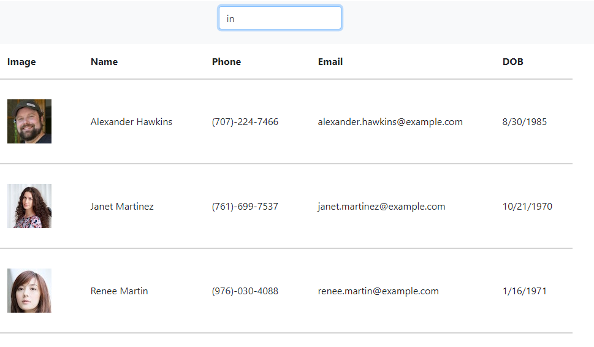

# team-directory


## Description
View and search a listing of Employees. Powered by React.

-----
## Table of Contents

* [Installation](#installation)
* [Usage](#usage)
* [License](#license)
* [Questions](#questions)


-----
## Installation
For a local instance, install with ``` npm i ```.  Note that this will create a React app.

## Usage
Opening the app will display a list of 10 employees (generated from [randomuser.me](randomuser.me)).

Type a name or number into the Search box to filter visible employees. This filter is based on all fields (Name, Phone number, Email, and Date of Birth).

Click the headers Name, Phone, or DOB to sort users. Click again to reverse the sort.



-----


## Links

[Live application](https://athear.github.io/team-directory)

[Github repository](https://github.com/Athear/team-directory)


  ## License
  Licensed under the [MIT](https://spdx.org/licenses/MIT.html) license.


## Questions
For additional questions, find me on [GitHub](https://github.com/athear).
